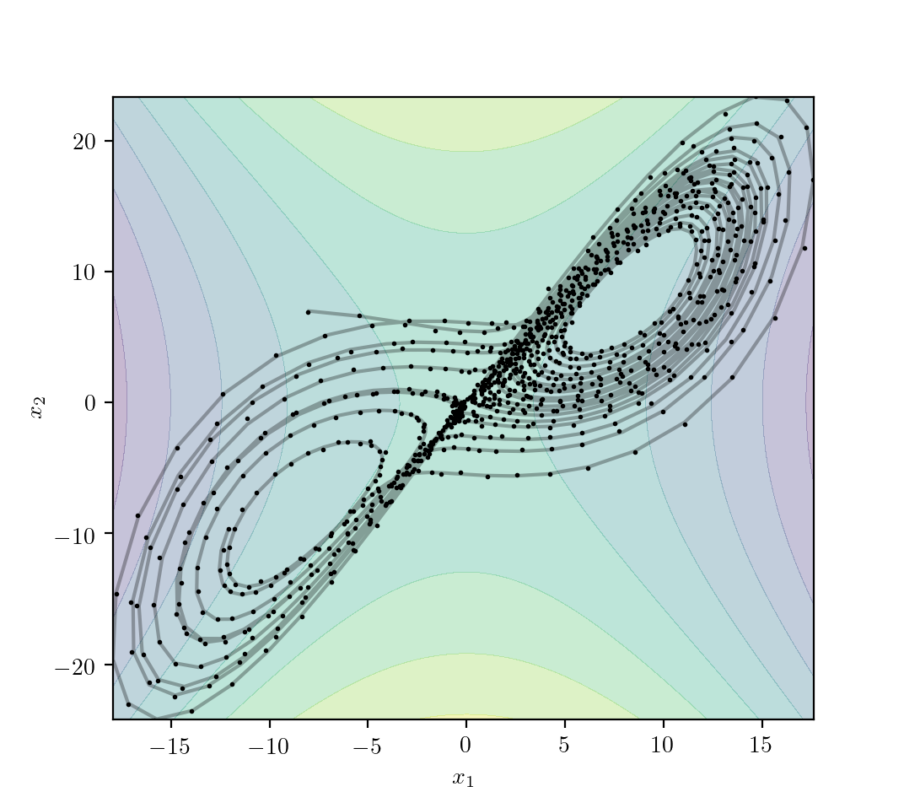
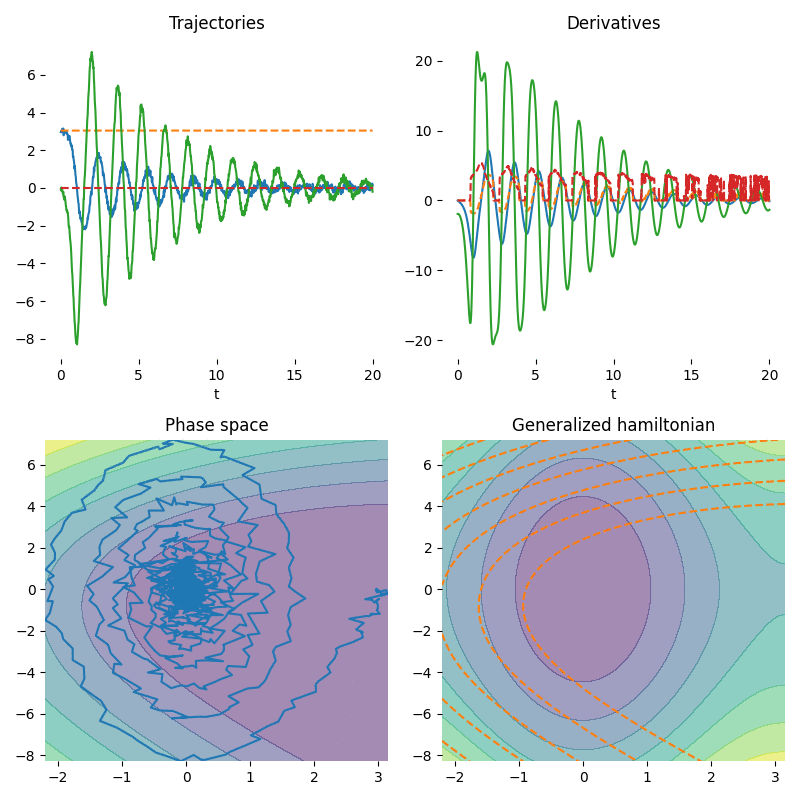

# Weak Form Generalized Hamiltonian Learning
This library provides a PyTorch implementation for performing Weak Form Generalized Hamiltonian Learning. This code accompanies this [Neurips2020 paper](https://papers.nips.cc/paper/2020/file/d93c96e6a23fff65b91b900aaa541998-Paper.pdf) [1] by Kevin L. Course, Trefor W. Evans, and Prasanth B. Nair.

As everything is written in PyTorch, all algorithms provide full GPU support. 

---

<p align="center">
  
</p>


Please cite our paper if you find this code useful in your research. The bibliographic information for the paper is,
```bash
@article{course2020weak,
  title={Weak Form Generalized Hamiltonian Learning},
  author={Course, Kevin L and Evans, Trefor W and Nair, Prasanth B},
  journal={Advances in Neural Information Processing Systems},
  volume={33},
  year={2020}
}
```
Our experiments make heavy use of Chen *et. al's* [torchdiffeq package](https://github.com/rtqichen/torchdiffeq) [2] and we use the rectified Huber unit from Kolter *et. al* [3]. 

---

## Installation 
```bash
pip install git+https://github.com/coursekevin/weakformghnn#egg=weakformghnn
```

## Library Overview
This library provides **three** main components:

* GHNN class: The class provides a convenient interface for specifying **strong priors** on the form of the generalized Hamiltonian. This module inherits from the torch nn.Module class. This allows GHNNs to be trained in the usual ways one can train a model for a continuous time ODE (ie. see [1,2]). See the ghnn_tutorial for an example of how to use this class in context.

* GHNNwHPrior class: This class has a similar structure to the main GHNN class except it should only be used when the generalized Hamiltonian is known. It can be trained in the same way as a standard GHNN. 

* weak_form_loss: Use this loss function to perform "weak form regression" with any model for a continuous time ODE. See the weakform_tutorial for an example. 


<p align="center">
  
</p>

## References
[1] Kevin L. Course, Trefor W. Evans, Prasanth B. Nair. "Weak Form Generalized Hamiltonian Learning." Advances in Neural Information Processing Systems. 2020.

[2] Ricky T. Q. Chen, Yulia Rubanova, Jesse Bettencourt, David Duvenaud. "Neural Ordinary Differential Equations." Advances in Neural Information Processing Systems. 2018.

[3] J. Z. Kolter and G. Manek. “Learning Stable Deep Dynamics Models”. In: Advances in Neural Information Processing Systems 32. Ed. by H. Wallach, H. Larochelle, A. Beygelzimer, F. d. Alché-Buc, E. Fox, and R. Garnett. Curran Associates, Inc., 2019, pp. 11126–11134.